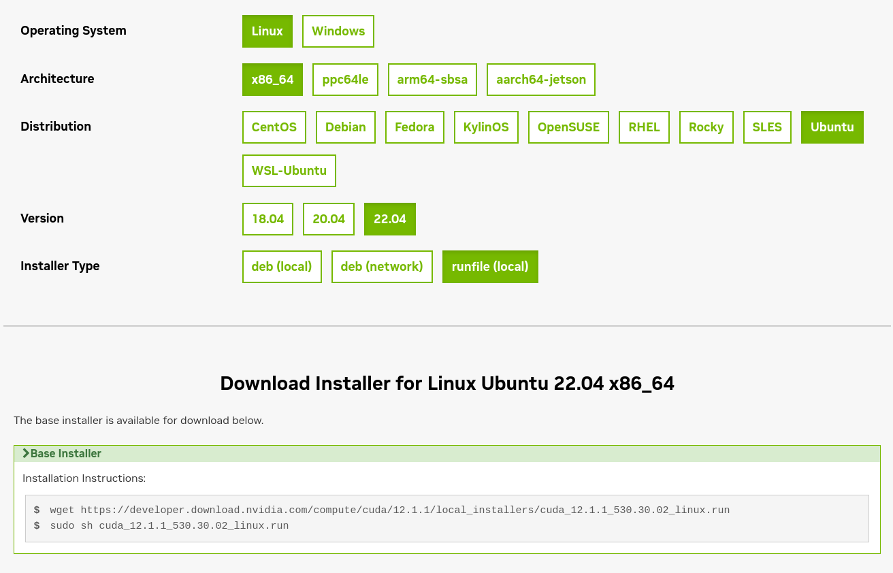

# CUDA Tutorial

This tutorial will guid your from the installation of CUDA Toolkit to some coding example and implementation.

Brievely:
- **What is CUDA ?**

CUDA is a parallel computing platform and programming model invented by NVIDIA. It enables increases in computing performance by using the power of the graphics processing unit. 
You can code with a specific language called CUDA (.cu) and improve your program in C/C++, python or Java.

- **What is CUDA Toolkit ?**

CUDA Toolkit is simply the environnement that allows you to perform everything we said above.
The first part of the tutorial will explains you how to setup everything.

- **How can I use CUDA ?**

You can use it for **AI and Data Science**, **High Performance Computing**, **Design and Simulation**, **Data Center and Cloud Computing** and many more.
Further information here: https://www.nvidia.com/en-us/


## Installation of CUDA Toolkit

### Prerequisite
Before you get into it, you obviously need a Graphical Card. If you don't have one anything from this tutorial will be useful for you. <br/>
But even if you have, you must verify that your Graphical Card is CUDA-capable.
In order to check this, find your Graphical Card model on this website: https://developer.nvidia.com/cuda-gpus

If now your sur that Graphical Card is CUDA capable, let's begin !


### Installation on Windows and Linux

This is the main portal to download CUDA Toolkit: https://developer.nvidia.com/cuda-downloads

From here it is simple, follow every steps and you will install the Toolkit easily.
At the last steps: **Installer Type**, you can chose several thing:
- deb local
- deb network
- runfile local

The first and third one are a large file where every components will be downloaded once and do not require a high-bandwidth internet. The second one is even more faster to download but your need to reload componetents each time your going to use the Toolkit.

What I'm suggesting you is to take the third option, because you only need two commands and everything is installed once.

exemple: 

### Automatic installation on Linux
If you are on Linux, enjoy the script I've made so you can install everything automatically, the file is called linuxInstaller.sh. Install it, give it the execution right with ```chmod +x linuxInstaller.sh``` and everything will setup fine.

### Installation doesn't work

There are different cases that make the installation failed:
- **Your Graphic Card isn't recognized by your system**: You have a graphic card but it said you are not CUDA-capable. To fix that you need to install the correct driver here: https://www.nvidia.com/en-us/geforce/drivers/
- **Your in a virtual machine**: I personnaly tryied to installed CUDA toolkit on VMware and my CG wasn't recognized. To fix that you need to add the PCI option in the settings of your virtual machine.
- **Cannot find compiler 'cl.exe' in PATH**: if you are on Windows, this error can occure. In this case find cl.exe and put it in your PATH. 

My personnal choice is to use WSL 2 on Windows, it was the only place where my GC was recognize by the system and where I got no error at the compilation...
However, if you have a regular installation of Linux, and not with a virtual machine, it should work normally.


## Let's code

It is now time to see whats Cuda look like and compile you first program. To do so, you will need a compiler called **nvcc**. It is already installed in the toolkit and very simple to use.

### First cuda code
The first way to code with Cuda is to put everything is a .cu file combining cuda and c/c++.
You have two examples of code in the **src** folder: **hello.cu** and **mult.cu**.

The first file is a hello world program and the second one a simple multiplication function.


Let's compile the mult.cu file:
```
nvcc src/mult.cu -o mult.o
```

You now have an executable file: **mult.o**. Then, execute the binary: 
```
./mult.o
```


## Tutorials about CUDA 

- CUDA toolkit installation: https://docs.nvidia.com/cuda/cuda-quick-start-guide/contents.html

- CUDA C++ Programming Guide: https://docs.nvidia.com/cuda/cuda-c-programming-guide/index.html#
