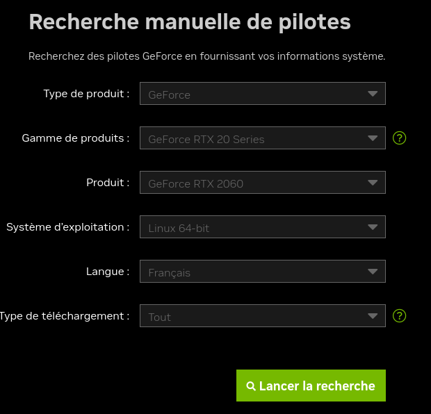

# CUDA Tutorial

This tutorial will guid your from the installation of CUDA Toolkit to some coding example and implementation.

Brievely:
- **What is CUDA ?**

CUDA is a parallel computing platform and programming model invented by NVIDIA. It enables increases in computing performance by using the power of the graphics processing unit. 
You can code with a specific language called CUDA (.cu) and improve your program in C/C++, python or Java.

- **What is CUDA Toolkit ?**

CUDA Toolkit is simply the environnement that allows you to perform everything we said above.
The first part of the tutorial will explains you how to setup everything.

- **How can I use CUDA ?**

You can use it for **AI and Data Science**, **High Performance Computing**, **Design and Simulation**, **Data Center and Cloud Computing** and many more.
Further information here: https://www.nvidia.com/en-us/


## Installation of CUDA Toolkit

### Prerequisite
Before you get into it, you obviously need a Graphical Card. If you don't have one anything from this tutorial will be useful for you. <br/>
But even if you have, you must verify that your Graphical Card is CUDA-capable.
In order to check this, find your Graphical Card model on this website: https://developer.nvidia.com/cuda-gpus

If now your sur that Graphical Card is CUDA capable, let's begin !


### Installation on Windows and Linux

This is the main portal to download CUDA Toolkit: https://developer.nvidia.com/cuda-downloads

From here it is simple, follow every steps and you will install the Toolkit easily.
At the last steps: **Installer Type**, you can chose several thing:
- deb local
- deb network
- runfile local

The first and third one are a large file where every components will be downloaded once and do not require a high-bandwidth internet. The second one is even more faster to download but your need to reload componetents each time your going to use the Toolkit.

What I'm suggesting you is to take the third option, because you only need two commands and everything is installed once.

exemple: 

- **Automatic script**:
If you are on Linux, enjoy the script I've made so you can install everything automatically, the file is called LinuxCudaInstaller.sh. Install it, give it the execution right with ```chmod +x LinuxCudaInstaller.sh``` and everything will setup fine.

- **Exception:** You have a Graphical Card but still you get an error saying your GPU isn't CUDA-capable 

In this case, your may not have installed your drivers ! To do so, go on this website: https://www.nvidia.com/en-us/geforce/drivers/

Here, you need to indicate your specification:


Download the file, excute it and your driver is now installed !


## Make your first CUDA program

Compile your .cu file: 
```
nvcc -c src/mult.cu -o mult.o
```

Compile your C++ file:
```
g++ -o main main.cpp src/mult.cu.o -I<path_to_cuda_include> -L<path_to_cuda_lib> -lcudart
```


## Tutorials about CUDA 

- Tutorials from installation to practising: https://developer.nvidia.com/how-to-cuda-c-cpp

- CUDA C++ Programming Guide: https://docs.nvidia.com/cuda/cuda-c-programming-guide/index.html#
